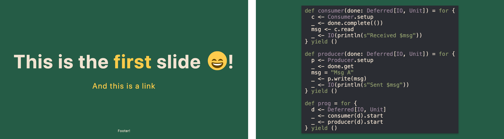

# TonioGela's Marp Slides Template

Slides template and theme to be used with [marp-cli], a handy "Markdown to slides" tool that features a presenter's view.

This theme reflects the one built for [my blog](https://toniogela.dev).



### Prerequisites
- [marp-cli](https://github.com/marp-team/marp-cli)
- [sass] to modify and rebuild the theme (optional)
- [just] to use the commands defined in the `justfile` (optional)
- [monolith] to pack the whole presentation in a single html file (optional)

## Instructions

To write your presentation, create a repository using this template and then:
- Remove the useless `images/example.png` and `README.md`
- Fill the `slides.md` file with your content

You may want to take a look at the many [Marpit Markdown](https://marpit.marp.app/markdown) features.

The deck of slides can then be built with:
- `marp --html true --theme-set ./theme/toniogela.css -- slides.md`
- `marp slides.md` (since there's a `.marprc.yml` file)
- `just build` (if you have installed `just`)

## Deploy your slides with GH Actions

A custom GH action to easily deploy the deckset is included.

This action is built to support a single `slides.md` file and a single `images` folder as the only sources for the presentation. It should be difficult to customise if you have different needs.

Once the repository gets created wait for the CI to complete at least once and then under `Settings > Pages` select `Deploy from a Branch` under `Source` and pick the newly created `gh-pages` `/(root)`.

If you're using a custom domain you'll need to modify the [cname in the workflow file](./.github/workflows/pages.yml#L41) and setup a corresponding `CNAME` DNS record on your domain to point to `<your-username>.github.io`.

## Customising the theme
[slides.md](./slides.md) and [toniogela.scss](./theme/toniogela.scss) should contain all customization instructions. The theme consists of just a few overrides over the default [uncover](https://github.com/marp-team/marp-core/blob/main/themes/uncover.scss) theme and customises the code highlight.

The file `toniogela.scss` should be compiled to css using [sass](https://sass-lang.com/install) with `sass --no-source-map toniogela.scss:toniogela.css` or `just theme`.

The repository already contains compiled version for ease.

## justfile
The repository contains a `justfile` to use with [just]. You can see the list of recipes running `just`, but the idea is that you can build the presentation using `just build`, bundle it using `just bundle`, get a pdf deckset using `just pdf` and so on.

I encourage you [to take a look at it](./justfile) because maintaining this file is easier than keeping this `README.md` updated.

## Bundling
To bundle the whole presentation as a single html file you can use [monolith] running `monolith slides.html --silent --output index.html ` or `just bundle`.

## Graphs
Cool graphs can be drawn using [Asciiflow] and then [converted to images](https://shaky.github.bushong.net/).

## VSCode Plugin
To use [the preview feature of VSCode](https://github.com/marp-team/marp-vscode#preview-marp-markdown) install the [VSCode Marp plugin](https://marketplace.visualstudio.com/items?itemName=marp-team.marp-vscode) and set the following properties:

```
"markdown.marp.enableHtml": true,
"markdown.marp.themes": ["./theme/toniogela.css"]
```
note that a [settings.json](.vscode/settings.json) is committed into the repo for ease.

## Other
The [Marp Github discussions](https://github.com/marp-team/marp/discussions) are really useful in case of doubts.

A list of supported emojis can be found [here](https://github.com/markdown-it/markdown-it-emoji/blob/3.0.0/lib/data/full.mjs).

---

To concatenate the first two slides I used imagemagick:
```
marp --images png -- slides.md
montage slides.001.png slides.002.png -tile x1 -geometry +50+0 -background transparent final.png
magick final.png -trim final.png
```

[marp-cli]: https://github.com/marp-team/marp-cli
[monolith]: https://github.com/Y2Z/monolith
[Asciiflow]: https://asciiflow.com/#/
[just]: https://github.com/casey/just
[sass]: https://sass-lang.com/install