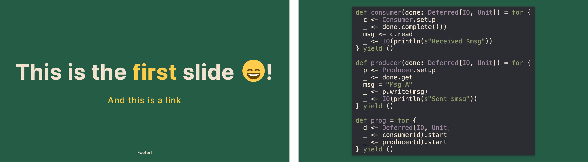

# TonioGela's Marp Slides Template

Slides template and theme to be used with [marp-cli], a handy "Markdown to slides" tool that features a presenter's view.

This theme reflects the one built for [my blog](https://toniogela.dev).



### Prerequisites
- [marp-cli](https://github.com/marp-team/marp-cli)
- [sass] to modify and rebuild the theme (optional)
- [monolith] to pack the whole presentation in a single html file (optional)

Or just [nix]: `nix-shell` drops you in a shell with all three of them, plus the helper commands defined in [shell.nix](./shell.nix).

## Instructions

To write your presentation, create a repository using this template and then:
- Remove the useless `images/example.png` and `README.md`
- Fill the `slides.md` file with your content

You may want to take a look at the many [Marpit Markdown](https://marpit.marp.app/markdown) features.

The deck of slides can then be built with:
- `marp --html true --theme-set ./theme/toniogela.css -- slides.md`
- `marp slides.md` (since there's a `.marprc.yml` file)
- `build` (inside `nix-shell`)

## Deploy your slides with GH Actions

A GH action that builds the deckset with [nix] and deploys it to [Cloudflare Workers] is included.

It is built to support a single `slides.md` file and a single `images` folder as the only sources for the presentation. It should be difficult to customise if you have different needs.

`nix-build` produces the whole thing: `public/` with the slides, the images and a `_headers` file, plus the `wrangler.jsonc` that deploys it. To point it at your own domain, edit the `name` and the `routes` pattern in [default.nix](./default.nix), and add `CLOUDFLARE_API_TOKEN` and `CLOUDFLARE_ACCOUNT_ID` to the repository secrets.

## Customising the theme
[slides.md](./slides.md) and [toniogela.scss](./theme/toniogela.scss) should contain all customization instructions. The theme consists of just a few overrides over the default [uncover](https://github.com/marp-team/marp-core/blob/main/themes/uncover.scss) theme and customises the code highlight.

The file `toniogela.scss` should be compiled to css using [sass](https://sass-lang.com/install) with `sass --no-source-map toniogela.scss:toniogela.css` or the `theme` command.

The repository already contains compiled version for ease.

## Commands
`nix-shell` puts a handful of commands on your `PATH` and prints the list on entry: `build` the presentation, `bundle` it into a single html file, get a `pdf` deckset, rebuild the `theme`, `preview` with live reload and `clean` up.

I encourage you [to take a look at them](./shell.nix) because maintaining that file is easier than keeping this `README.md` updated.

## Bundling
To bundle the whole presentation as a single html file you can use [monolith] running `monolith slides.html --silent --output index.html ` or the `bundle` command.

## Graphs
Cool graphs can be drawn using [Asciiflow] and then [converted to images](https://shaky.github.bushong.net/).

## VSCode Plugin
To use [the preview feature of VSCode](https://github.com/marp-team/marp-vscode#preview-marp-markdown) install the [VSCode Marp plugin](https://marketplace.visualstudio.com/items?itemName=marp-team.marp-vscode) and set the following properties:

```
"markdown.marp.enableHtml": true,
"markdown.marp.themes": ["./theme/toniogela.css"]
```
note that a [settings.json](.vscode/settings.json) is committed into the repo for ease.

## Other
The [Marp Github discussions](https://github.com/marp-team/marp/discussions) are really useful in case of doubts.

A list of supported emojis can be found [here](https://github.com/markdown-it/markdown-it-emoji/blob/3.0.0/lib/data/full.mjs).

---

To concatenate the first two slides I used imagemagick:
```
marp --images png -- slides.md
montage slides.001.png slides.002.png -tile x1 -geometry +50+0 -background transparent final.png
magick final.png -trim final.png
```

[marp-cli]: https://github.com/marp-team/marp-cli
[monolith]: https://github.com/Y2Z/monolith
[Asciiflow]: https://asciiflow.com/#/
[sass]: https://sass-lang.com/install
[nix]: https://nixos.org/download/
[Cloudflare Workers]: https://developers.cloudflare.com/workers/static-assets/
