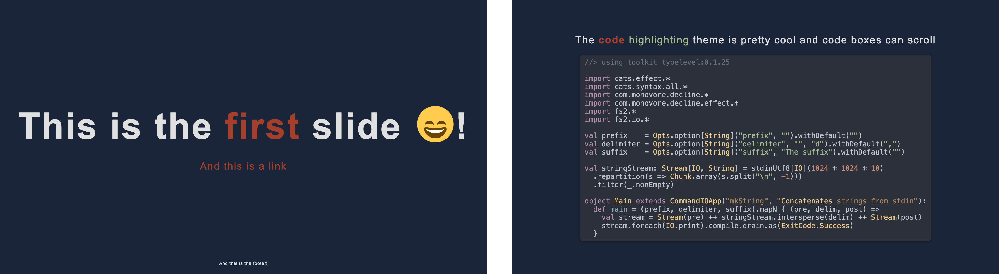

# TonioGela's Marp Slides Template

Slides template to use with [marp-cli], a handy Markdown to Slides tool



### Prerequisites
- [marp-cli](https://github.com/marp-team/marp-cli)
- [sass] to modify and rebuild the theme (optional)
- [just] to use the commands defined in the `justfile` (optional)
- [monolith] to pack the whole presentation in a single html file (optional)

## Instructions

To write your presentation, create a repository using this template and fill the `slides.md` file with your content. You may want to take a look at the [Marpit Markdown](https://marpit.marp.app/markdown) features.

The deck of slides can then be built with:
- `marp --html true --theme-set ./theme/toniogela.css -- slides.md`
- `marp slides.md` (since there's a `.marprc.yml` file)
- `just build` (if you have installed `just`)

## Deploy your slides with GH Actions

//TODO!

## Customising the theme
[slides.md](./slides.md) and [toniogela.scss](./theme/toniogela.scss) should contain all customization instructions. The theme consists of just a few overrides over the default [uncover](https://github.com/marp-team/marp-core/blob/main/themes/uncover.scss) theme and customises the code highlight.

The file `toniogela.scss` should be compiled to css using [sass](https://sass-lang.com/install) with `sass --no-source-map toniogela.scss:toniogela.css` or `just theme`.

The repository already contains compiled version for ease.

## justfile
The repository contains a `justfile` to use with [just]. You can see the list of recipes running `just`, but the idea is that you can build the presentation using `just build`, bundle it using `just bundle`, get a pdf deckset using `just pdf` and so on.

I encourage you [to take a look at it](./justfile) because maintaining this file is easier than keeping this `README.md` updated.

## Bundling
To bundle the whole presentation as a single html file you can use [monolith] running `monolith slides.html --silent --output index.html ` or `just bundle`.

## Graphs
Cool graphs can be drawn using [Asciiflow] and then [converted to images](https://shaky.github.bushong.net/).

## VSCode Plugin
To use [the preview feature of VSCode](https://github.com/marp-team/marp-vscode#preview-marp-markdown) install the [VSCode Marp plugin](https://marketplace.visualstudio.com/items?itemName=marp-team.marp-vscode) and set the following properties:

```
"markdown.marp.enableHtml": true,
"markdown.marp.themes": ["./theme/toniogela.css"]
```
note that a [settings.json](.vscode/settings.json) is committed into the repo for ease.

## Other
The [Marp Github discussions](https://github.com/marp-team/marp/discussions) are the best place for info.

For the list of emojis see [here](https://github.com/markdown-it/markdown-it-emoji/blob/3.0.0/lib/data/full.mjs)

[marp-cli]: https://github.com/marp-team/marp-cli
[monolith]: https://github.com/Y2Z/monolith
[Asciiflow]: https://asciiflow.com/#/
[just]: https://github.com/casey/just
[sass]: https://sass-lang.com/install