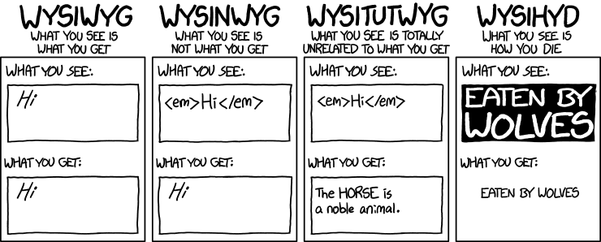

<style>
   :root { 
      /* Overrides like the slide's color go here */
      /* --color-background: #255C46 !important; */
      /* refer to theme/toniogela.scss for variables names */
     }
</style>

<!-- _footer: "And this is the footer!" -->

# <!-- fit --> This is the **first** slide :smile:!

[And this is a link](http://google.com)

---

The **code** *highlighting* theme is pretty cool and code boxes can scroll

```scala
//> using toolkit typelevel:0.1.25

import cats.effect.*
import cats.syntax.all.*
import com.monovore.decline.*
import com.monovore.decline.effect.*
import fs2.*
import fs2.io.*

val prefix    = Opts.option[String]("prefix", "").withDefault("")
val delimiter = Opts.option[String]("delimiter", "", "d").withDefault(",")
val suffix    = Opts.option[String]("suffix", "The suffix").withDefault("")

val stringStream: Stream[IO, String] = stdinUtf8[IO](1024 * 1024 * 10)
  .repartition(s => Chunk.array(s.split("\n", -1)))
  .filter(_.nonEmpty)

object Main extends CommandIOApp("mkString", "Concatenates strings from stdin"):
  def main = (prefix, delimiter, suffix).mapN { (pre, delim, post) =>
    val stream = Stream(pre) ++ stringStream.intersperse(delim) ++ Stream(post)
    stream.foreach(IO.print).compile.drain.as(ExitCode.Success)
  }
```

---

Inline code like `"foobar"` appears in a box.

`It's not really optimized, so different inlines may overlap`
`but usually adding a further newline fixes the issue`

`like this` :point_left:

---

It's possible to render inline **math** such as $ax^2+bc+c$.

or putting more complicated expressions on newlines

$$ I_{xx}=\int\int_Ry^2f(x,y)\cdot{}dydx $$

$$
f(x) = \int_{-\infty}^\infty
    \hat f(\xi)\,e^{2 \pi i \xi x}
    \,d\xi
$$

---

<!-- _backgroundColor: #2E294E -->
<!-- _color: #F49D6E -->

Changing a single slides's background and text color is as trivial as adding this

```
<!-- _backgroundColor: #2E294E -->
<!-- _color: #F49D6E -->
```

in the slide's code

---



Images can `fit` on a side of the screen

---


or `fill` it

---

It's possible to create lists that appear element by element just using `*`

:drum: :drum: :drum:

* I'm the first
* I'm the second
* I'm the last

---

- This is a list
- but it uses `-` as bullet
- so it appears all at once

---

## Last but **not least**

Deploying this decksets is dead stupid if you
use `Github Actions` and `Github Pages`

[See the instructions](https://github.com/TonioGela/marp?tab=readme-ov-file#deploy-your-slides-with-gh-actions)

---

## *Bonus* slide

If you use `monolith` you can share the 
rendered deckset as a single portable html file

[See how](https://github.com/TonioGela/marp?tab=readme-ov-file#deploy-your-slides-with-gh-actions)